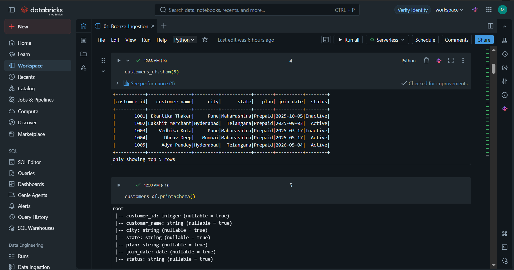
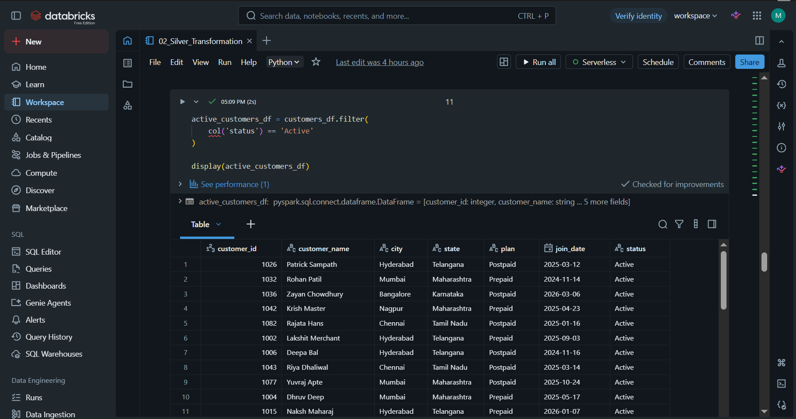
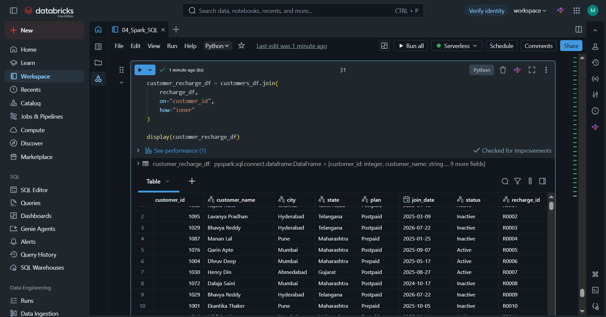
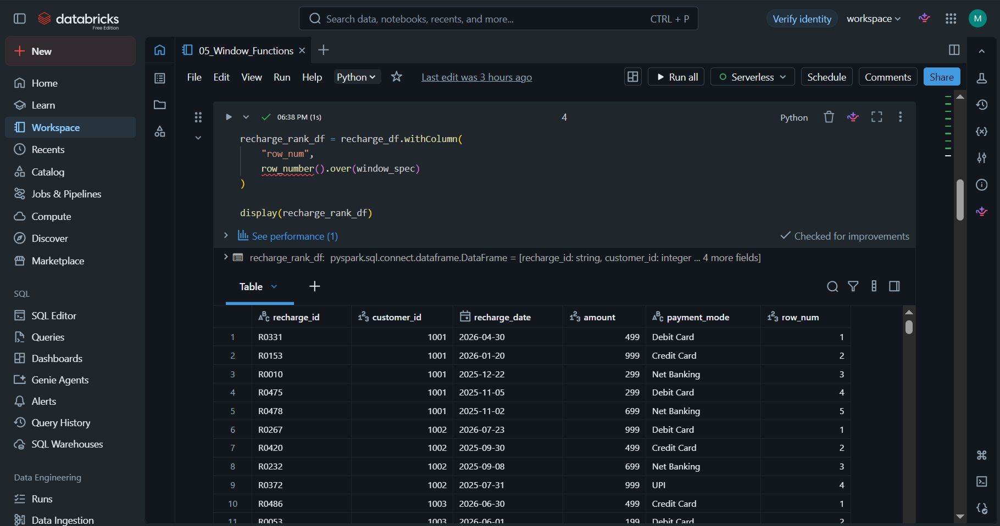
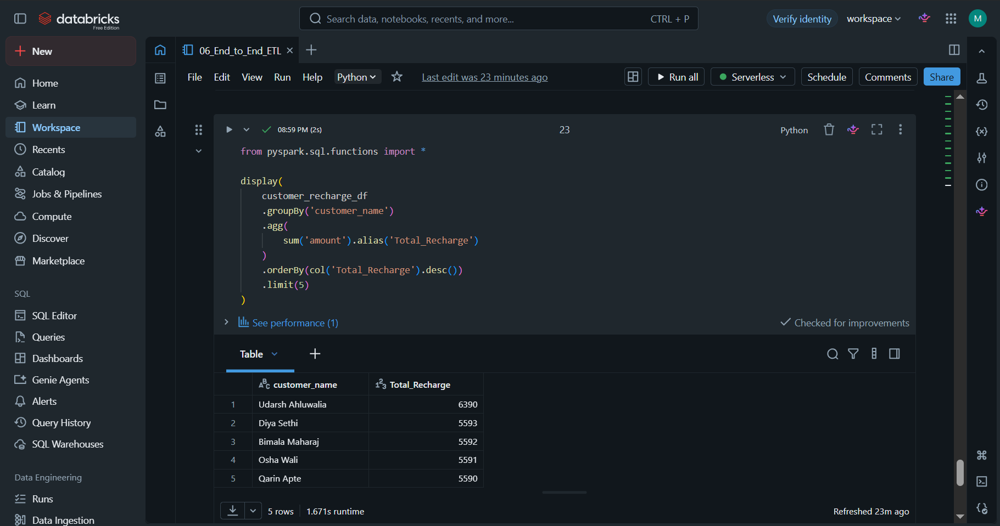

# End-to-End Telecom Data Engineering Pipeline

## Project Overview

This project demonstrates an end-to-end Telecom Data Engineering Pipeline built using PySpark, Spark SQL, Databricks Community Edition, and Delta Lake concepts.

The pipeline simulates a real telecom company's ETL workflow by ingesting raw customer data, transforming it into clean business-ready datasets, and generating analytical reports.

---

# Architecture

```
CSV Files
    │
    ▼
Bronze Layer (Raw Ingestion)
    │
    ▼
Silver Layer (Data Cleaning & Validation)
    │
    ▼
Gold Layer (Business Analytics)
    │
    ▼
Spark SQL
    │
    ▼
Joins
    │
    ▼
Window Functions
    │
    ▼
Business Reports
```

---

# Technologies Used

- Python
- PySpark
- Spark SQL
- Databricks Community Edition
- Delta Lake Concepts
- Git
- GitHub
- Pandas
- Faker

---

# Project Structure

```text
telecom-data-engineering-pipeline/

datasets/
scripts/
notebooks/
screenshots/
docs/
README.md
```

---

# Datasets

The project contains four telecom datasets.

| Dataset | Description |
|----------|-------------|
| customers.csv | Customer Master Data |
| recharge.csv | Recharge Transactions |
| usage.csv | Data, Call and SMS Usage |
| complaints.csv | Customer Complaints |

---

# ETL Workflow

## Bronze Layer

- Read raw CSV files
- Infer schema
- Validate records

## Silver Layer

- Data Cleaning
- Remove duplicates
- Handle null values
- Rename columns
- Transform data

## Gold Layer

Generate Business KPIs including:

- Customers by Plan
- Recharge Revenue
- Complaint Analysis
- Data Usage Analysis
- Customer Analytics

---

# PySpark Concepts Used

- DataFrames
- Schema Inference
- withColumn()
- withColumnRenamed()
- filter()
- where()
- select()
- orderBy()
- groupBy()
- agg()
- alias()
- drop()
- Window Functions
- Spark SQL
- Joins

---

# Joins

Implemented:

- Inner Join
- Left Join
- Left Anti Join
- Left Semi Join

---

# 🪟 Window Functions

- row_number()
- rank()
- dense_rank()
- partitionBy()
- orderBy()

---

# Project Screenshots

## Bronze Layer



---

## Silver Layer



---

## Customer & Recharge Join



---

## Window Functions



---

## Gold Layer KPI



---

# Setup Instructions

Clone the repository

```bash
git clone https://github.com/morerohan48484/telecom-data-engineering-pipeline.git
```

Open Databricks Community Edition.

Upload all CSV files into a Unity Catalog Volume.

Run notebooks in the following order:

1. Bronze Ingestion
2. Silver Transformation
3. Gold Analytics
4. Spark SQL
5. Window Functions
6. End-to-End ETL

---

# Sample Input

customers.csv

| customer_id | customer_name | city |
|-------------|---------------|------|
|1001|Ekantika Thaker|Pune|

---

# Sample Output

Top 5 Customers by Total Recharge

| Customer | Total Recharge |
|----------|---------------:|
|Dhruv Deep|4995|
|Adya Pandey|4598|

---

# Skills Demonstrated

- Data Engineering
- ETL Pipeline
- PySpark
- Spark SQL
- Databricks
- Data Cleaning
- Aggregations
- Joins
- Window Functions
- Git & GitHub

---

# Future Improvements

- Delta Tables
- Incremental ETL
- Azure Data Lake Storage
- Azure Data Factory
- CI/CD Pipeline
- Power BI Dashboard

---

# Author

**Rohan More**

GitHub:

https://github.com/morerohan48484
